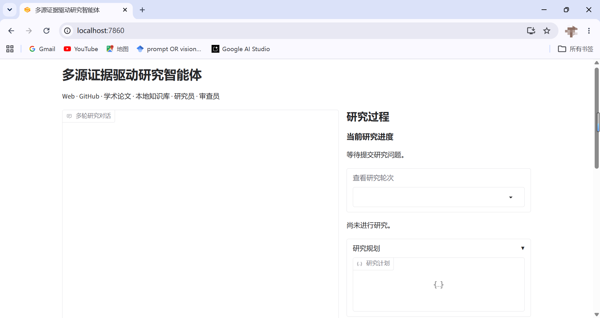
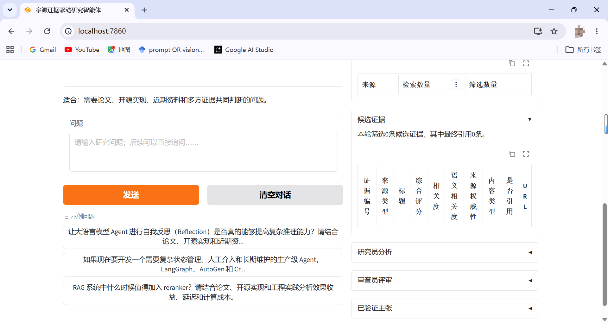
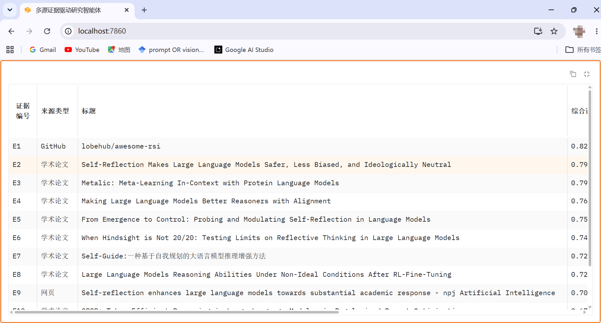
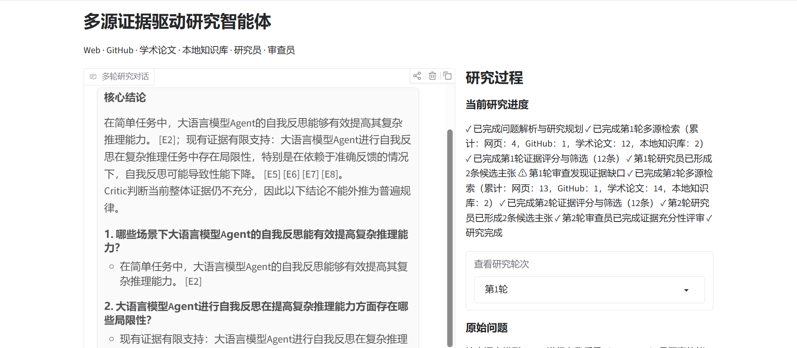
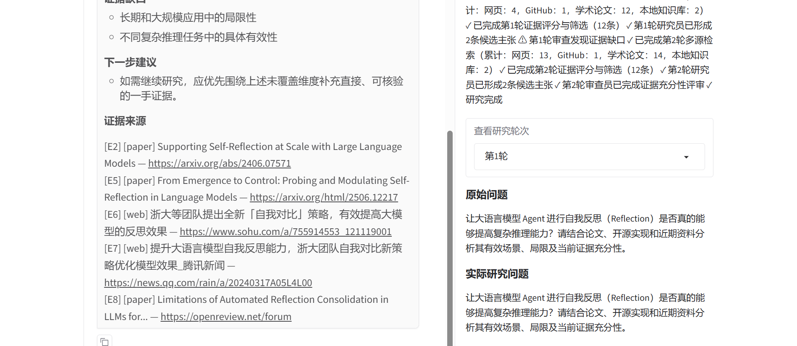
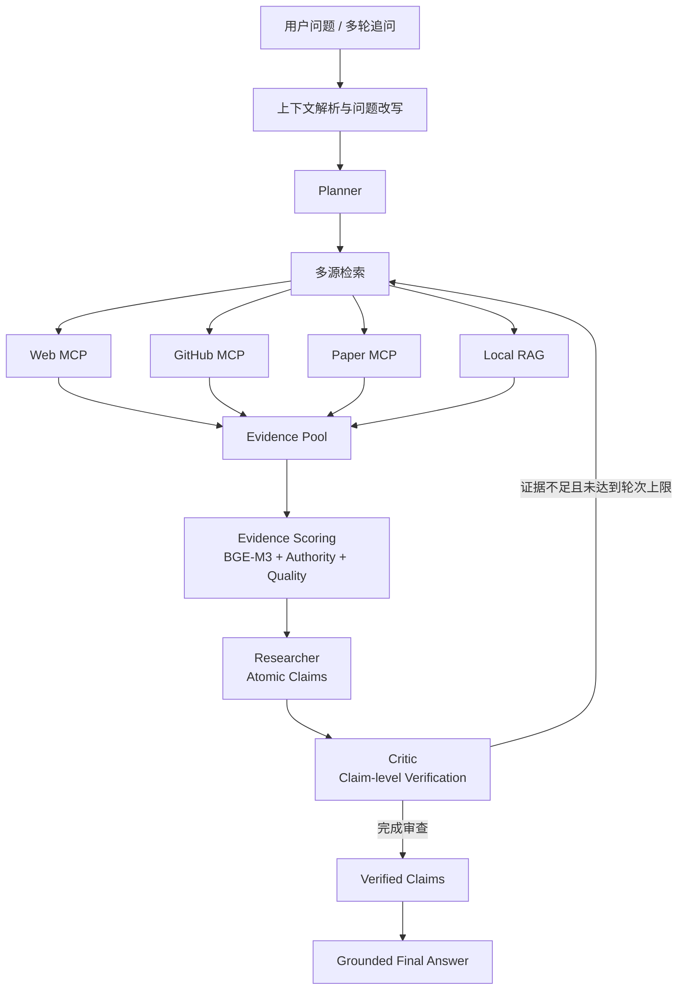

# Evidence-Driven Research Agent

一个基于 **LangGraph** 的多源证据驱动研究智能体。系统面向“需要检索、比较、验证和综合判断”的开放问题，通过 Web、GitHub、学术论文和本地知识库进行多源检索，并结合 **BGE-M3 语义相关性、Evidence Scoring、Researcher–Critic 审查、Claim-level Verification** 与可追溯引用生成回答。

项目提供中文 **Gradio 多轮研究界面** 与 CLI，支持围绕上一轮结果继续追问，并展示研究规划、检索来源、证据评分、Researcher 分析、Critic 审查和 Verified Claims 等中间过程。

## 项目亮点

- **多源检索**：统一接入 Web、GitHub、学术论文与本地 RAG，降低单一数据源带来的信息偏差。
- **Source-aware Retrieval**：根据不同数据源采用差异化检索策略，Web 支持中英查询，GitHub 以英文检索为主，Paper 支持多 Provider 回退。
- **多语言语义评估**：使用 BGE-M3 对中英文证据进行统一语义相关性计算，并结合来源权威性、完整性等指标进行 Evidence Scoring。
- **Researcher–Critic 协作**：Researcher 生成原子化 Claims，Critic 对 Claim 与 Evidence 的支持关系进行审查，并在证据不足时触发定向补充检索。
- **Claim-level Grounding**：只有通过审查的 Verified Claims 才能进入最终事实性结论，降低 unsupported claim 和引用幻觉。
- **多轮研究交互**：支持对上一轮回答进行解释、继续深挖或切换新主题，并保留每轮 Research Trace。
- **可视化研究过程**：Gradio 页面展示 Planner、检索统计、Evidence、Critic、Verified Claims 与节点级运行进度。

## 界面展示

下面展示部分 Gradio 页面截图。完整截图保存在 [`assets/screenshots/`](assets/screenshots/) 目录中。

<p align="center">
  
  
</p>

<p align="center">
  
  
  
</p>

## 系统工作流



当前工作流最多进行两轮检索：第一轮完成初始多源研究，Critic 若发现关键证据缺口，可触发第二轮定向补充检索。

## 适合的问题

该项目更适合没有单一标准答案、需要结合多类资料进行判断的问题，例如：

- LLM Agent 的 Reflection 是否真的能提高复杂推理能力？在哪些场景有效，哪些情况下收益有限？
- RAG 系统在什么情况下值得加入 reranker？效果收益、在线延迟和计算成本如何权衡？
- 如果开发需要复杂状态管理、人工介入和长期维护的生产级 Agent，LangGraph、AutoGen 和 CrewAI 应如何选择？
- 某个开源 Agent 框架当前是否仍值得用于新项目？其官方状态、GitHub 维护情况和替代方案如何？

不适合用完整 Research Workflow 处理简单定义题、基础知识问答或无需外部证据的问题。

## 项目结构

```text
app/                     # Gradio Web 入口
research_agent/
  agents/                # Researcher 与 Critic
  llm/                   # 本地 Qwen 适配器
  rag/                   # LangChain FAISS 知识库与 BGE-M3 语义相关度
  retrieval/             # Web / GitHub / Paper MCP 检索客户端
  workflow/              # LangGraph 状态、节点与工作流
mcp_servers/             # Web、GitHub、Paper MCP stdio 服务
scripts/                 # CLI 与本地知识库索引构建入口
data/knowledge/          # 用户自行准备的本地知识文件
assets/screenshots/       # Gradio 页面截图
```

## 技术栈

- **LLM**：Qwen2.5-Instruct（本地部署，路径可配置）
- **Agent Workflow**：LangGraph
- **RAG**：LangChain + FAISS
- **Embedding**：BGE-M3
- **Tool Protocol**：MCP
- **Retrieval**：Web Search、GitHub API、Semantic Scholar / OpenAlex / arXiv
- **Frontend**：Gradio

## 安装

建议使用 Python 3.10 或 3.11。项目不会自动下载 Qwen 或 BGE-M3 模型。

如果使用 CUDA，请先按照 [PyTorch 官方安装说明](https://pytorch.org/get-started/locally/) 安装与机器 CUDA 环境匹配的 PyTorch，再安装其余依赖：

```bash
pip install -r requirements.txt
```

## 配置

复制 `.env.example` 并填写本机配置。代码不会自动加载 `.env`，请通过 shell 导出变量。例如 Linux/macOS：

```bash
cp .env.example .env
set -a
source .env
set +a
```

必须设置：

- `LLM_MODEL_PATH`：本地 Qwen2.5-Instruct 模型目录。
- `EMBEDDING_MODEL_PATH`：本地 BGE-M3 模型目录。

可选设置：

- `WEB_PROXY`：Web/MCP 客户端代理；留空时直接联网。
- `GITHUB_TOKEN`：提高 GitHub API 请求限额；匿名访问也可使用。
- `SEMANTIC_SCHOLAR_API_KEY`：Semantic Scholar API Key；留空时论文检索可使用 OpenAlex，并对英文查询回退到 arXiv。
- `OPENALEX_MAILTO`：可选的 OpenAlex 联系邮箱。

示例：

```bash
export LLM_MODEL_PATH=/path/to/Qwen2.5-7B-Instruct
export EMBEDDING_MODEL_PATH=/path/to/bge-m3
export WEB_PROXY=http://127.0.0.1:7890   # 可选
export GITHUB_TOKEN=your_token_here      # 可选
```

> 不要将真实 Token、私人服务器地址或本地绝对路径提交到 GitHub。`.env` 已设计为本地配置文件，仓库只保留 `.env.example`。

## 本地知识库

将 `.txt`、`.md` 或 `.pdf` 文件放入 `data/knowledge/`。除公开示例文件外，该目录中的个人知识文件默认不提交到 Git。

构建本地 FAISS 索引：

```bash
python -m scripts.build_index
```

索引写入 `data/index/`，同样不提交到 GitHub。更换 Embedding 模型后需要重新构建索引。

## 运行

### CLI

从项目根目录运行：

```bash
python -m scripts.run_cli
```

### Gradio Web UI

```bash
python -m app.web_app
```

默认监听 `0.0.0.0:7860`。如果项目运行在远程服务器，可通过 SSH 端口转发访问：

```bash
ssh -L 7860:localhost:7860 user@your-server
```

然后在本地浏览器访问：

```text
http://localhost:7860
```

## 设计说明

### 为什么不直接让 LLM 基于搜索结果生成答案？

系统将检索、证据评分、结论生成和证据审查拆成独立阶段。Researcher 只能基于候选 Evidence 形成 Claims，Critic 再检查 Claim 是否得到直接证据支持，最终只允许 Verified Claims 作为事实性结论输出。

### 为什么使用 BGE-M3？

系统的用户问题、本地知识库、Web 页面、GitHub README 和论文摘要可能同时包含中文与英文。BGE-M3 用于在统一多语言向量空间中计算语义相关性，避免将所有证据预先翻译成同一种语言。

### 为什么保留多种论文来源？

外部 API 可能出现限流或临时不可用，因此 Paper Retrieval 使用多 Provider 策略，并允许从官方学术网页结果中识别论文 Evidence，提高研究流程在真实网络环境下的鲁棒性。

## 已知限制

- 当前默认使用本地 7B 级指令模型，复杂 Evidence Synthesis 和细粒度 Claim 抽取仍受基础模型能力限制。
- Web / GitHub / Paper 的检索结果会受到搜索引擎、API 限流和网络状态影响，因此不同运行之间可能存在差异。
- Claim-level Verification 更偏向“宁缺毋滥”，在证据不足时可能生成较保守、较简短的回答。
- 当前多轮上下文主要面向单次浏览器会话，不提供跨会话长期记忆。
- 本项目定位为 Research Agent 工程原型，不等价于系统性文献综述工具。

## License

当前仓库暂未添加开源许可证。若需要允许他人复制、修改或分发代码，请根据实际需求选择并添加合适的 LICENSE（如 MIT 或 Apache-2.0）。
